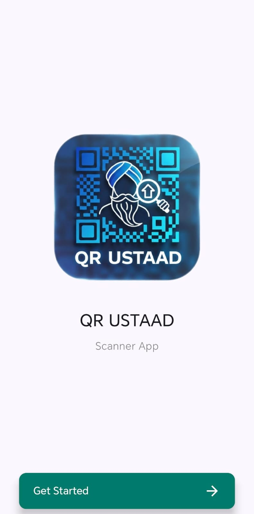
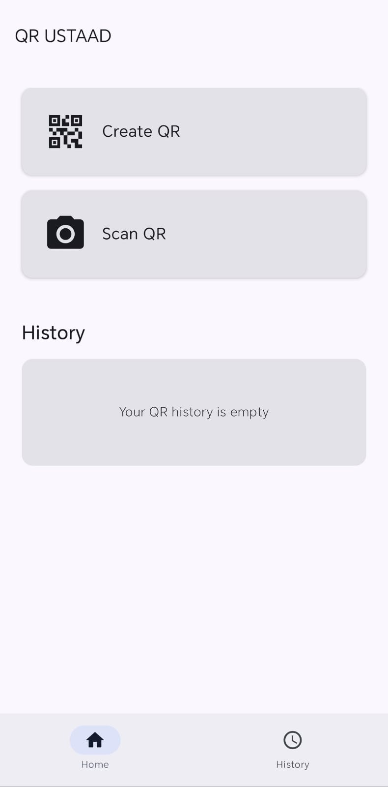
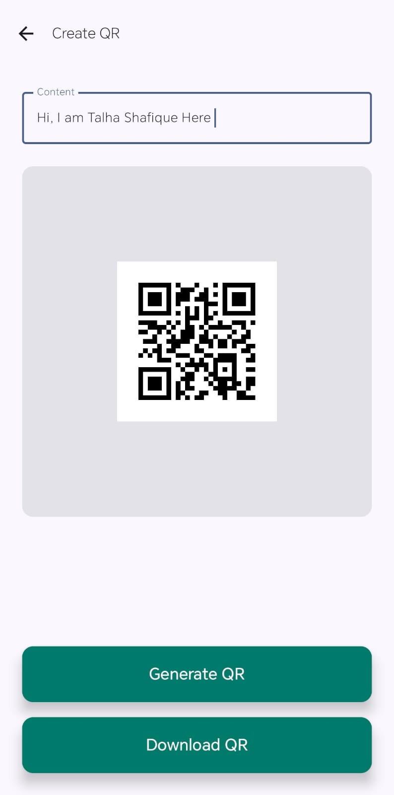
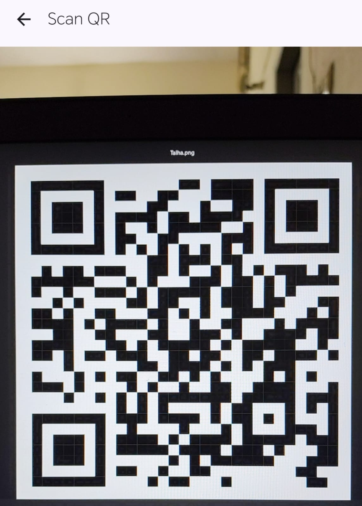
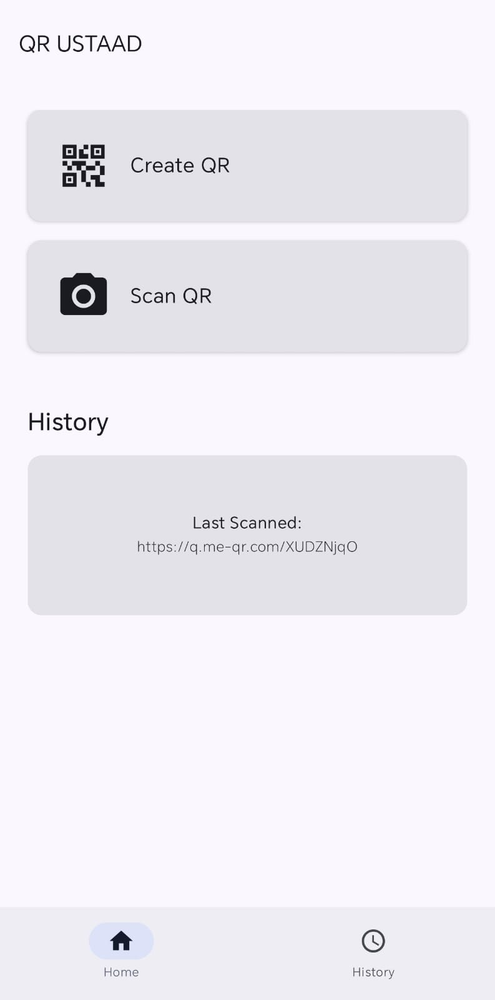

# 📲 QRUstaad App (Created By : Talha Shafique)
QR Ustaad Scanner App

## 📦 Description QR Ustaad Scanner App
The QRUstaad App is the definitive, all-in-one mobile solution for QR code and barcode management. Built for speed and reliability, the application allows users to effortlessly scan any standard 1D or 2D code (including QR codes, Data Matrix, UPC, and EAN) using the device's camera. Beyond scanning, users can generate custom QR codes instantly for sharing websites, Wi-Fi details, contact information, and plain text. This powerful platform ensures real-time decoding and offers a complete history of all scanned and generated codes, providing a seamless, fast, and transparent experience for all your code interaction needs.

## ⚙️ Technologies Used
- 💻 **Language:** Kotlin  
- 🎨 **UI Framework:** Jetpack Compose (Material 3)  
- 🧩 **Architecture:** Clean Architecture 
- 📸 **Camera/Scanning:** CameraX + Google ML Kit (Barcode Scanning) + ZXing (for generation/additional scanning)

## 📱 App Screenshots

| **1. Splash Screen** | **2. Home Screen** | **3. Create QR Screen** | **4. Scan QR Screen** | **5. Result Screen** |
| :---: | :---: | :---: | :---: | :---: |
|  |  |  |  |  |

